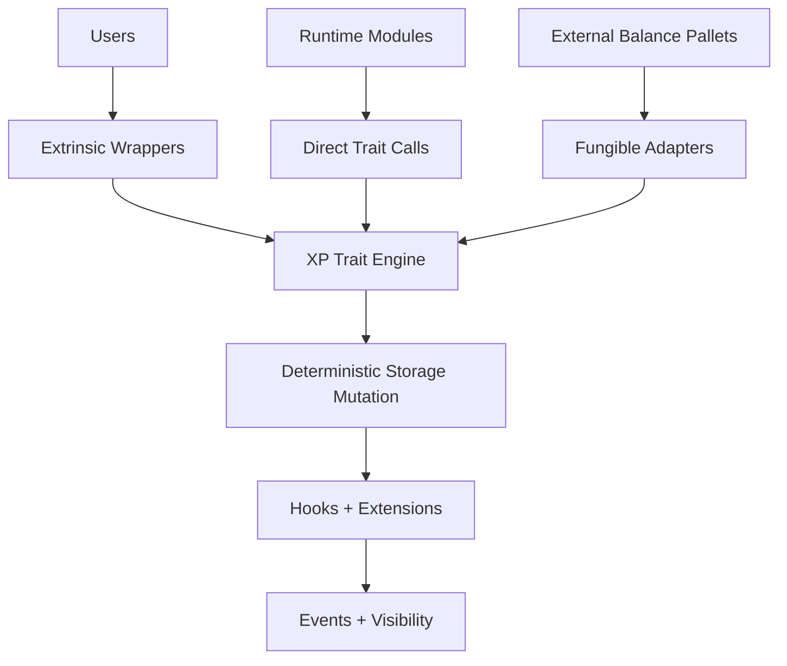

# 🧱 Call Surface 

The execution model of `pallet-xp` is built on a simple architectural rule:

> all logic lives in traits
> all public access happens through thin wrappers

This is called the **call surface**.

It defines how users, runtime modules, and external pallets reach XP logic without directly touching storage. 

The pallet never follows:

```text 
User -> Extrinsic -> Direct Storage Write
```

Instead it follows:

```text
User -> Wrapper Layer -> XP Traits -> Storage
```

and

```text
Runtime -> Direct Trait Calls -> Storage
```

This separation is intentional.

### Problem Without a Call Surface

If extrinsics directly handled business logic:

* logic gets duplicated
* runtime integrations become difficult
* testing becomes harder
* pallets cannot safely reuse behavior
* invariants become inconsistent

This creates fragile architecture.

### Solution With a Call Surface

All execution closes into:

```text
XP Trait Engine
```

and every external interaction becomes only a controlled wrapper.

This gives:

| Benefit                   | Result                      |
| ------------------------- | --------------------------- |
| 🔒 Single mutation engine | predictable behavior        |
| ♻️ Logic reuse            | easier runtime composition  |
| 🧪 Better testing         | traits tested independently |
| 🧩 Modular design         | pallets integrate safely    |
| ⚙️ Deterministic mutation | no unsafe storage shortcuts |

This is why the call surface is an architectural boundary, not just an API.

---

## Traits First, Extrinsics Second

XP is not designed as an extrinsic-first pallet.

It is designed as a **trait-first system**.

The real execution engine is:

| Core Trait  | Responsibility        |
| ----------- | --------------------- |
| `XpSystem`  | reads + validation    |
| `XpOwner`   | ownership control     |
| `XpMutate`  | XP growth + mutation  |
| `XpReserve` | soft constraints      |
| `XpLock`    | hard constraints      |
| `XpReap`    | lifecycle termination |
| `BeginXp`   | safe lifecycle start  |

These traits define:

* who owns XP
* how XP grows
* how constraints work
* how lifecycle starts
* how lifecycle ends

---

## Why Extrinsics Are Thin Wrappers

Users cannot call traits directly.

They need runtime access through signed transactions.

That means the pallet must provide:

| User Requirement       | Provided By |
| ---------------------- | ----------- |
| Transaction signing    | Extrinsics  |
| Origin verification    | Extrinsics  |
| Ownership checks       | Extrinsics  |
| Permission enforcement | Extrinsics  |
| Event visibility       | Extrinsics  |

But extrinsics should not own protocol logic.

They should only:

```text
authenticate
-> validate
-> forward
```

> Extrinsics provide access.

> Traits provide behavior.

---

# Three Call Surfaces

The architecture exposes three execution paths.

All three eventually reach the same XP trait engine.

## 1. Public Call Surface (User Extrinsics)

This is how external users interact with XP.

Flow:

```text
User
-> Signed Extrinsic
-> Validation Layer
-> XP Trait Execution
-> Storage Mutation
```

Users never mutate storage directly. They enter only through controlled wrappers.

### Core Dispatchable Extrinsics

| Extrinsic                | Architectural Role        | Final Trait Destination |
| ------------------------ | ------------------------- | ----------------------- |
| `call()`                 | XP-scoped execution       | runtime dispatch        |
| `handover()`             | ownership transition      | `XpOwner`               |
| `dispose()`              | lifecycle finalization    | `XpReap`                |
| `force_handover()`       | governance override       | `XpOwner`               |
| `force_genesis_config()` | runtime parameter control | config updates          |

These are execution gateways, not business logic functions.

### Example `handover()`

The user calls:

```rust
handover(origin, xp_id, new_owner)
```

The extrinsic performs:

| Step | Action                           |
| ---- | -------------------------------- |
| 1    | `ensure_signed(origin)`          |
| 2    | verify owner of `xp_id`          |
| 3    | validate destination             |
| 4    | call `XpOwner::transfer_owner()` |
| 5    | emit event                       |

The actual ownership mutation happens inside the trait. The extrinsic only protects access 🔐

---

## 2. Internal Call Surface (Runtime Trait Access)

Other pallets should not need extrinsics. They need direct composability.

This is why XP traits are runtime-native interfaces.

Flow:

```text
Runtime Module
-> Direct Trait Call
-> XP Mutation
-> Storage
```

Example:

```rust
XpMutate::earn_xp(...)
```

This means:

* no dispatch
* no signed origin
* no wrapper
* only protocol composition

### Common Runtime Operations

| Runtime Action | Trait Function  |
| -------------- | --------------- |
| Create XP      | `begin_xp()`    |
| Earn XP        | `earn_xp()`     |
| Reserve XP     | `set_reserve()` |
| Lock XP        | `set_lock()`    |
| Slash XP       | `slash_xp()`    |
| Reap XP        | `try_reap()`    |

This is where most real execution happens.

Not inside extrinsics.

### Runtime Integrators

Typical integrations include:

| System               | XP Usage                   |
| -------------------- | -------------------------- |
| Governance           | participation reputation   |
| Staking              | reserve / lock constraints |
| Missions             | contributor progression    |
| Validators           | commitment reputation      |
| Participation Layers | protocol activity tracking |

This is where XP becomes protocol-native.

### The Special Case -> `call()`

Among all extrinsics, `call()` is different.

It is not just a wrapper.

It is the architectural bridge between:

```text
AccountId -> XpId
```

This is the center of the entire pallet 🧠

### What `call()` Actually Does

### Dispatch Flow

```text
ensure_signed(origin)
-> verify owner(origin, xp_id)
-> elevate XpId into execution subject
-> dispatch RuntimeCall as Signed(XpId)
```

This transforms:

```text
Signed(AccountId)
```

into:

```text
Signed(XpId)
```

inside runtime execution. That transformation is what makes XP identity-native.

Without this, XP would only be metadata. With this, XP becomes execution itself.

### Authority vs Execution

| Layer       | Responsibility     |
| ----------- | ------------------ |
| `AccountId` | signs + authorizes |
| `XpId`      | executes + mutates |

Core rule:

> 👤 Account authorizes
> 🧠 XP executes

This is the architectural heart of `pallet-xp`.

---

## 3. Fungible Adapters Surface

Some pallets do not use XP traits directly.

They expect standard Substrate balance interfaces:

```rust
frame_support::traits::fungible::*
```

Instead of forcing custom integrations, XP exposes fungible adapters.

This creates:

```text 
External Pallet
-> Fungible Adapter
-> XP Traits
-> Storage
```

Again: 

Traits remain the real engine. Adapters are only wrappers.

### Adapter Mapping

| External Operation | Internal XP Trait |
| ------------------ | ----------------- |
| `hold()`           | `set_reserve()`   |
| `freeze()`         | `set_lock()`      |
| `mint_into()`      | `set_xp()`        |
| `burn_from()`      | `slash_xp()`      |

This allows:

* governance pallets
* staking systems
* hold/freeze integrations
* standard Substrate pallets

to work with XP without custom rewrites.

### Unified Call Surface Closure

All execution paths eventually close into the same place:

```text
XP Trait Engine
```

That closure guarantees:

| Guarantee                | Why It Matters         |
| ------------------------ | ---------------------- |
| One mutation engine      | consistent execution   |
| One validation model     | safer runtime behavior |
| One lifecycle system     | predictable XP rules   |
| One execution philosophy | identity-first design  |

This prevents fragmented logic. That is what makes the architecture safe.

---

## Full Call Surface Architecture



Everything ends in the same place:

> XP trait execution

never direct storage mutation.


## 🚀 Next Steps

To start using `pallet-xp` in your runtime, the next step is setting up the pallet and configuring its required dependencies.

👉 **Getting Started -> [Installation](../getting-started/installation.md)**

