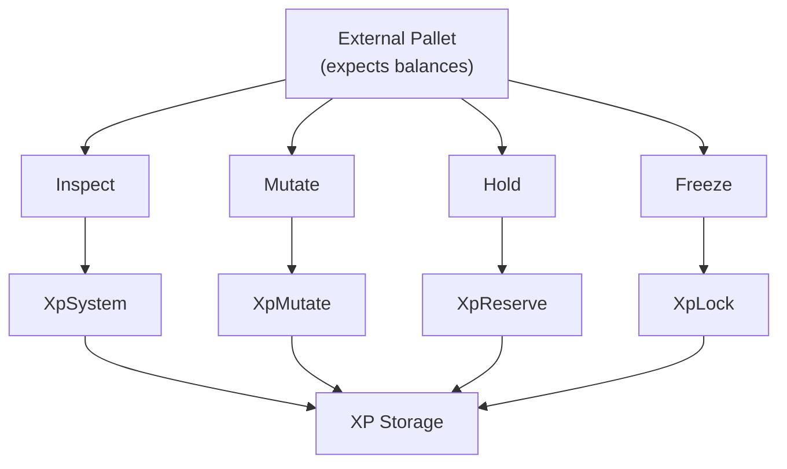

# 🔌 Fungible Adapter

`pallet-xp` provides a **fungible compatibility layer** for interoperability with standard Substrate pallets.

> ⚠️ XP is **not truly fungible**
>
> The adapter exists only so other pallets can interact with XP using familiar balance-like interfaces.

This allows XP to work with pallets expecting `frame_support::traits::fungible::*` traits while preserving XP's identity-first design. 

---

## Why This Exists

Many Substrate pallets are designed around:

* balances
* mint / burn
* hold / freeze
* inspect / mutate

XP is not a token system, but some integrations still require these interfaces.

The fungible adapter bridges that gap ✨

---

## Implemented Traits

The pallet implements these compatible fungible traits:

| Fungible Trait   | XP-backed Behavior           |
| ---------------- | ---------------------------- |
| `Inspect`        | Read XP balances             |
| `Unbalanced`     | Direct XP balance writes     |
| `Mutate`         | Mint / burn style operations |
| `InspectHold`    | Reserve inspection           |
| `InspectFreeze`  | Lock inspection              |
| `UnbalancedHold` | Reserve mutation             |
| `MutateFreeze`   | Lock mutation                |
| `MutateHold`     | Hold compatibility           |

These are implemented internally using XP traits like:

* `XpSystem`
* `XpMutate`
* `XpReserve`
* `XpLock` 

---

## 1. Inspect Layer

Provides read-only balance-style access to XP.

This helps external pallets ask:

> how much XP is available?

without knowing XP internals.

### Key Behavior

| Method                | XP Meaning         |
| --------------------- | ------------------ |
| `balance()`           | Free / liquid XP   |
| `total_balance()`     | Free + reserved XP |
| `minimum_balance()`   | Always `0`         |
| `reducible_balance()` | Liquid XP only     |

### Important Difference

#### `total_issuance()`

```rust
panic!()
```

This always **panics**.

Why?

Because XP has:

* no global supply
* no inflation model
* no issuance tracking

XP is earned, not minted like currency 🚫

Same applies to:

```rust
active_issuance()
```

This also panics. 

---

## 2. Unbalanced Layer

Provides direct balance mutation.

This bypasses normal XP earning flow.

Used for:

* internal runtime adjustments
* administrative corrections
* compatibility operations

### Key Methods

| Method                 | Behavior              |
| ---------------------- | --------------------- |
| `write_balance()`      | Directly sets free XP |
| `increase_balance()`   | Adds XP               |
| `decrease_balance()`   | Removes XP            |
| `set_total_issuance()` | No-op                 |

Unlike `earn_xp()`, this does not apply Pulse logic.

It directly updates storage ⚙️

---

## 3. Mutate Layer

Provides mint / burn style operations expected by fungible pallets.

Even though XP is non-transferable, mutation compatibility is still useful.

### Key Methods

| Method          | Behavior                   |
| --------------- | -------------------------- |
| `mint_into()`   | Add XP                     |
| `burn_from()`   | Remove XP                  |
| `shelve()`      | Temporary removal          |
| `set_balance()` | Direct XP replacement      |

### Transfer Is Forbidden

#### `transfer()`

Always returns:

```rust
Error::CannotTransferXp
```

Because:

> XP value cannot be transferred

Only XP ownership can change.

This is one of the most important invariants 🔐 

---

## 4. Hold Adapter -> Reserve

Maps fungible **hold** behavior to XP reserves.

In fungible systems:

```text
hold = temporarily allocated balance
```

In XP:

```text
hold = reserve
```

### Mapping

| Fungible                | XP                 |
| ----------------------- | ------------------ |
| Hold                    | Reserve            |
| Hold Reason             | ReserveReason      |
| `balance_on_hold()`     | `get_reserve_xp()` |
| `set_balance_on_hold()` | `set_reserve()`    |

This gives reserve compatibility without custom pallet logic 📦

---

## 5. Freeze Adapter -> Lock

Maps fungible **freeze** behavior to XP locks.

In fungible systems:

```text
freeze = restricted balance
```

In XP:

```text
freeze = lock
```

### Mapping

| Fungible           | XP              |
| ------------------ | --------------- |
| Freeze             | Lock            |
| Freeze Id          | LockReason      |
| `balance_frozen()` | `get_lock_xp()` |
| `set_freeze()`     | `set_lock()`    |
| `thaw()`           | `burn_lock()`   |

This gives native compatibility for staking and commitment systems 🔒

---

## Adapter Flow



The adapter translates balance expectations into XP-native operations.

## What Is NOT Supported

### ❌ No True Fungibility

XP does not support:

* total issuance
* inflation
* transferable value
* existential deposits
* supply economics

It only provides compatibility where safe.

This is interoperability, not tokenization.

---

## Design Principle

| Token System      | XP System              |
| ----------------- | ---------------------- |
| Fungibility first | Identity first         |
| Transfer value    | Preserve reputation    |
| Global supply     | Contextual progression |
| Economic asset    | Execution primitive    |

The adapter never changes this philosophy.

It only exposes safe compatibility layers.

---

## Compatibility Boundaries (In Short)

| Feature              | Supported |
| -------------------- | --------- |
| Inspect balances     | ✅         |
| Mutate balances      | ✅         |
| Holds                | ✅         |
| Freezes              | ✅         |
| Transfers            | ❌         |
| Issuance             | ❌         |
| Inflation            | ❌         |
| Existential Deposits | ❌         |

---

## 💡 Key Insight

> 🔌 Fungible traits are adapters,
> not XP's true model

XP remains:

* identity-bound
* non-transferable
* reputation-driven

The fungible layer simply helps the rest of the runtime speak to it.

---

## 🚀 Next Steps

Next, understand how users and runtime logic interact with XP via lossely coupled call-surfaces.

👉 **Architecture -> [Call Surface](./call-surface.md)**
