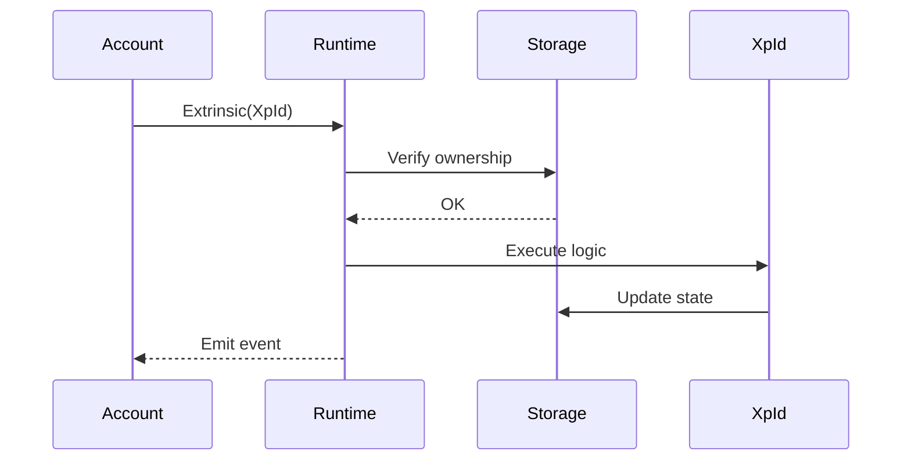
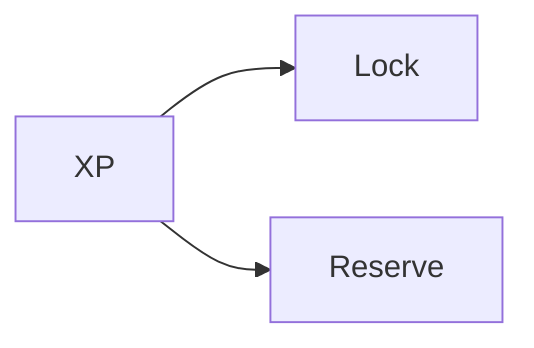
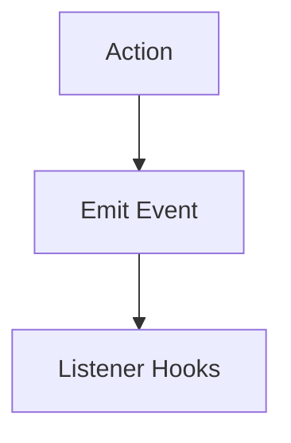

---

toc_min_heading_level: 2
toc_max_heading_level: 2
---

# 🏗️ Overview

`pallet-xp` is a **modular, trait-driven system** for managing XP identities, reputation, and execution.

It is not a balance pallet.

It is a runtime-native identity layer built around:

* XP identities (`XpId`)
* reputation-driven progression (Pulse)
* scoped execution through ownership
* programmable constraints (Lock / Reserve)
* interoperability through traits and adapters

The architecture is designed for extensibility, safety, and protocol-level composition.

---

## What the Architecture Separates

The pallet cleanly separates:

* state storage
* execution logic
* reputation mechanics
* ownership validation
* constraint handling
* external integration (traits + adapters)

This avoids monolithic design and makes each system independently composable.

---

## 1. XP Identity Layer

The identity layer is the foundation of the pallet.

### Core Role

* `XpId` = primary runtime identity
* execution subject
* storage key
* ownership target

An account does not "hold XP".

It owns one or more XP identities.

### Why This Matters

This allows:

* multiple independent identities per account
* XP-scoped execution
* isolated behavioral state
* protocol-native identity logic

XP becomes something the runtime acts *through*, not just something it stores.

---

## 2. Storage Layer

The storage layer holds all persistent XP state.

Every important system behavior is backed by explicit storage.

### Core Storage Maps

| Storage           | Purpose                                                         |
| ----------------- | --------------------------------------------------------------- |
| 🧩 `XpOf`         | Main XP state (`free`, `reserve`, `lock`, `pulse`, `timestamp`) |
| 👤 `XpOwners`     | Ownership mapping                                               |
| 🔒 `LockedXpOf`   | Lock records                                                    |
| 📦 `ReservedXpOf` | Reserve records                                                 |
| 🧹 `ReapedXp`     | Reaped / invalidated XP tracking                                |

Storage reflects both value and behavioral history.

---

## 3. Trait-Based System

The pallet is built using traits, not monolithic logic.

Each behavior is separated into a dedicated interface.

This makes the system reusable across runtimes and easier to integrate with other pallets.

### Core Traits

| Trait       | Purpose              |
| ----------- | -------------------- |
| `XpSystem`  | Read/query XP        |
| `XpOwner`   | Ownership management |
| `XpMutate`  | Create and earn XP   |
| `XpReserve` | Reserve XP           |
| `XpLock`    | Lock XP              |
| `XpReap`    | Remove inactive XP   |

Traits define capability boundaries.

This is one of the strongest architectural decisions in the pallet.

---

## 4. Execution Flow

All runtime interaction follows a strict identity validation model.

```text
origin: AccountId
input:  XpId
ensure: owner(origin, XpId)
```

This guarantees that accounts authorize actions, but XP identities define execution scope.

### Execution Pipeline



Execution is identity-scoped, not account-scoped.

---

## 5. Pulse Engine

Pulse is embedded inside mutation logic.

It is not a separate subsystem.

It is part of how XP is earned.

### Placement


The pulse engine lives inside `XpMutate`.

This ensures reputation and XP growth cannot be separated.

### Role

Pulse:

* 🚦 controls when XP earning begins
* 🛡️ prevents same-block abuse
* 📈 scales rewards using reputation
* 🔒 accelerates growth when XP is locked

It transforms XP from a balance system into a behavioral system.

---

## 6. Constraint System

Constraints are modular behavioral controls.

They do not transfer XP.

They define how XP may be used.


### 🔒 Lock

Strict restriction.

Represents commitment.

### 📦 Reserve

Soft allocation.

Represents intent.

Both are reason-based and runtime-controlled.

### Placement



Constraints shape behavior, not ownership.

---

## 7. Event & Extension Layer

The pallet supports events and listener hooks for external integrations.

This creates extensibility without changing core logic.

### Flow



Events are for observability.

Extensions are for protocol behavior.

### Purpose

* 🔌 External integrations
* 🧠 Custom runtime extensions
* 👀 Monitoring and analytics
* ⚙️ Lifecycle hooks for other pallets

This makes XP usable across the wider runtime.

---

## 8. Fungible Adapter Layer

XP provides partial compatibility with fungible traits.

This exists for interoperability, not because XP is a true balance system.

### Important Clarification

* ❌ XP is not truly fungible
* ❌ There is no total issuance model
* ❌ XP is not a transferable asset

The adapter exists so other pallets can reuse balance-oriented logic safely.

### Placement


This allows compatibility without compromising XP semantics.

---

## Design Principles

### 1. Separation of Concerns

Identity, logic, storage, and constraints are independent.

This improves maintainability and correctness.

### 2. Trait-Driven Architecture

Each responsibility is modular and composable.

Traits prevent tight coupling.

### 3. Identity-Centric Execution

All runtime logic operates on `XpId`, not directly on accounts.

This is the defining design principle of the pallet.

### 4. Extensibility

Hooks, listeners, and adapters allow seamless integration with other pallets.

The system is built for protocol composition.

---

## Final Insight

> ⚙️ `pallet-xp` is not just storage.
> 🧠 It is an identity-driven execution layer
> with built-in reputation mechanics.

That is what makes the architecture fundamentally different from balance pallets.

---

## 🚀 Next Steps

To understand how state is stored in detail:

👉 **Architecture -> [Storage](./storage.md)**
