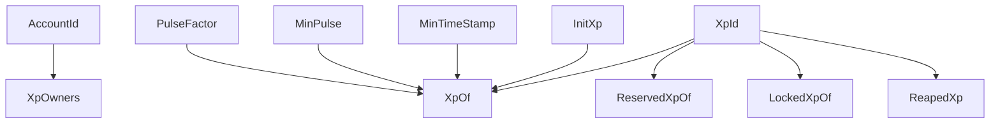

# 🗂️ Storage Architecture

Storage is the foundation of `pallet-xp`.

It defines how XP identities persist, how reputation evolves, how constraints are enforced, and how lifecycle rules remain safe across runtime execution.

Unlike simple balance systems, XP storage tracks:

* identity ownership
* behavioral progression
* reputation state
* lock and reserve constraints
* liveness and reaping state
* protocol configuration

This makes storage part of the protocol logic, not just passive persistence. 

---

## Storage Philosophy

XP storage is designed around one principle:

> 🧠 Store behavior, not just balances

Traditional token systems mainly store balances.

`pallet-xp` stores:

* who owns the identity
* how reputation progresses
* whether XP is usable
* whether it is committed
* whether the identity is still alive

This is why XP behaves like a living runtime identity.

---

# Core Runtime Storage

These are the primary storage structures used by the pallet.

## 1. `XpOf`

The main storage map for XP state.

```rust
XpId => Xp
```

This stores the full behavioral state of every XP identity. ⚙️

### What It Contains

Each XP entry stores:

| Field         | Meaning                    |
| ------------- | -------------------------- |
| `free`        | Liquid XP (Spendable)      |
| `reserve`     | Reserved XP (Usable)       |
| `lock`        | Locked XP (Restricted)     |
| `pulse.value` | Reputation level           |
| `pulse.step`  | Progress toward next pulse |
| `timestamp`   | Last activity block        |

This is the most important storage item in the entire pallet.

### Why It Matters

`XpOf` is where:

* XP earning updates happen
* pulse progression is tracked
* inactivity is determined
* reward scaling is derived

Without `XpOf`, XP does not exist.

---

## 2. `XpOwners`

Maps ownership between accounts and XP identities.

```rust
(AccountId, XpId) => ()
```

This defines:

> who controls which XP identity

It is implemented as an ownership index for fast validation.

### Why It Matters

Used for:

* authorization checks
* execution validation
* ownership transfer
* listing all XP keys for an account

This powers:

```rust
ensure(owner(origin, XpId))
```

Without this, XP-scoped execution would not be secure 🔐

---

## 3. `ReservedXpOf`

Stores all reserve constraints for each XP identity.

```rust
XpId => Vec<IdXp<ReserveReason, Value>>
```

Each entry contains:

* reserve reason
* reserved amount

Bounded by the number of reserve reason variants.

### Why It Matters

This enables:

* governance deposits
* proposal participation
* temporary allocations
* reason-scoped reservations

Reserve is soft constraint storage 📦

---

## 4. `LockedXpOf`

Stores all hard lock constraints for each XP identity.

```rust
XpId => Vec<IdXp<LockReason, Value>>
```

Each entry contains:

* lock reason
* locked amount

Also bounded by reason enum size.

### Why It Matters

This enables:

* staking
* protocol-enforced commitments
* pulse acceleration
* reaping protection

Lock is hard constraint storage 🔒

---

## 5. `ReapedXp`

Blacklist of permanently removed XP identities.

```rust
XpId => ()
```

Once reaped:

* XP cannot be recreated
* identity cannot be reused

This prevents resurrection attacks.

### Why It Matters

Reaping is final.

This storage guarantees:

> deleted XP stays deleted

which is critical for protocol safety 🧹

---

# Global Configuration Storage

These are runtime-wide system parameters.

They are stored on-chain and can be updated by root.

They are not compile-time constants.

## 6. `MinPulse`

Minimum reputation required before XP rewards begin.

```rust
MinPulse<Pulse>
```

Before this threshold:

* actions build Pulse only

After reaching it:

* XP rewards activate

This is the warmup gate 🚦

---

## 7. `InitXp`

Initial XP assigned to newly created identities.

```rust
InitXp<Points>
```

Every new `XpId` begins with this value.

This creates predictable initialization behavior.

---

## 8. `PulseFactor`

Controls how Pulse grows.

```rust
PulseFactor<Stepper>
```

Contains:

* `threshold`
* `per_count`

### Behavior

```text
step += per_count

if step >= threshold:
    pulse += 1
    step resets
```

This controls how fast reputation grows 📈

---

## 9. `MinTimeStamp`

Minimum liveness threshold.

```rust
MinTimeStamp<BlockNumber>
```

If:

```text
timestamp < MinTimeStamp
AND no active locks
```

then:

* XP becomes inactive
* it becomes eligible for reaping

This powers liveness enforcement.

---

# Storage Relationships



This shows how runtime behavior depends on storage interaction.

---

## Read vs Write Patterns

Not all storage is mutated equally.

### Frequently Written

* `XpOf`
* `LockedXpOf`
* `ReservedXpOf`

These change during normal protocol activity.

Examples:

* earning XP
* locking
* reserving
* pulse updates

### Rarely Written

* `MinPulse`
* `InitXp`
* `PulseFactor`
* `MinTimeStamp`

These are governance-level configuration values.

Usually changed only by `Root`.

### Write Once (Mostly)

* `ReapedXp`

Once written, it should never be reversed.

This is final-state storage ⚠️

---

## Design Properties

### 1. Identity-Centric

Everything is keyed by `XpId`, not accounts or balances.

This preserves execution scope.

### 2. Reason-Isolated

Locks and reserves are separated by explicit reason identifiers.

This prevents conflicts across pallets.

### 3. Reaping-Safe

Deleted identities are permanently blacklisted.

This prevents state resurrection.

### 4. Runtime-Configurable

System behavior can evolve without migrations.

Configuration lives in storage.

---

## Final Insight

> 🗂️ Storage in `pallet-xp` does not just track value.
> It tracks identity, behavior, commitment, and liveness.

That is why XP behaves like a protocol-native identity system, not a balance pallet.

---

## 🚀 Next Steps

To understand how traits dispatch and execution work internally:

👉 **Architecture -> [Traits](./traits.md)**
