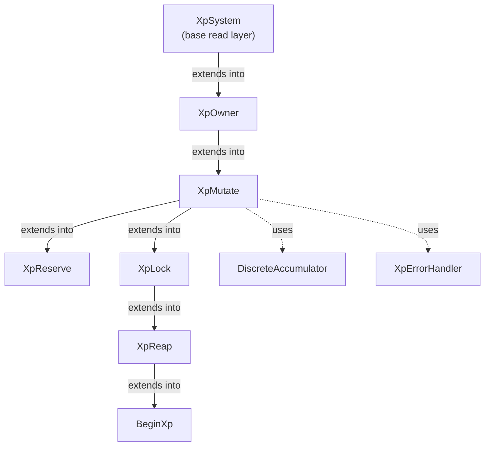

# 🧩 XP Traits Architecture

`pallet-xp` is built around a **trait-driven architecture**.

Instead of placing all logic inside one large pallet implementation, responsibilities are separated into focused XP traits from the `frame_suite::xp` family.

This makes the system:

* modular
* composable
* easier to test
* easier to integrate across pallets
* safer to extend over time

Each trait represents a specific capability of the XP system. 

---

## Why Traits Matter

XP is not just storage.

It is a runtime-native identity system with:

* ownership
* execution
* reputation growth
* reserve and lock constraints
* lifecycle management

A monolithic design would make this difficult to maintain.

Traits solve this by separating concerns cleanly ✨

---

## Core XP Trait Family

| Trait       | Responsibility               | Focus                   |
| ----------- | ---------------------------- | ----------------------- |
| `BeginXp`   | XP initialization entrypoint | Controlled creation     |
| `XpSystem`  | Read/query XP state          | Validation + inspection |
| `XpOwner`   | Ownership control            | Authorization           |
| `XpMutate`  | Create + earn XP             | Mutation + Pulse        |
| `XpReserve` | Reserve XP                   | Soft constraints        |
| `XpLock`    | Lock XP                      | Hard constraints        |
| `XpReap`    | Remove XP                    | Lifecycle termination   |

Additional helper traits:

| Helper Trait          | Purpose                |
| --------------------- | ---------------------- |
| `DiscreteAccumulator` | Pulse step progression |

These traits make the pallet modular instead of monolithic.

---

## 1. `BeginXp`

`BeginXp` is the safe initialization entrypoint for XP identities.

Its main purpose is:

> ensure a reaped `XpId` can never be initialized again

Unlike `XpMutate`, which handles normal creation and updates, `BeginXp` first checks reaping history before allowing initialization.

This guarantees lifecycle finality and prevents resurrection attacks 🧹

### Relationship with `XpMutate`

| Trait      | Responsibility                                       |
| ---------- | ---------------------------------------------------- |
| `BeginXp`  | Safe first-time initialization with reap protection  |
| `XpMutate` | Standard creation, earning, updates, reset, slashing |

Use:

* `BeginXp` -> to safely start a given XP Key.
* `XpMutate` -> for normal lifecycle operations

### Key Method

| Method     | Signature    | Description |
| ---------- | ------------ | -------------- |
| `begin_xp` | `fn begin_xp(Owner, Key, Xp) -> DispatchResult` | Creates XP only if the given key was never reaped |


### Why It Matters

Without `BeginXp`, deleted XP could be recreated.

`BeginXp` ensures:

* reaping stays final
* deleted identities stay deleted
* XP lifecycle remains safe 🔐

---

## 2. `XpSystem`

`XpSystem` provides the **read-only foundation** of the XP layer.

It answers:

> What XP exists and what is its current state?

Everything else depends on this trait.

### Key Methods

| Method  | Signature | Description |
| --------| ----------| ------------|
| `xp_exists` | `fn xp_exists(XpKey) -> DispatchResult` | Validates whether an XP identity exists  |
| `has_minimum_xp` | `fn has_minimum_xp(XpKey) -> DispatchResult` | Checks minimum XP threshold requirements |
| `get_liquid_xp`| `fn get_liquid_xp(XpKey) -> Result<Points, DispatchError>`| Returns liquid XP after constraints|
| `get_usable_xp`| `fn get_usable_xp(XpKey) -> Result<Points, DispatchError>` | Returns total usable XP |

### Why It Matters

Every XP operation starts here 🔍

Before mutation, reserve, lock, or reap:

the runtime must first validate that the XP identity exists.

This is the read foundation of the pallet.

---

## 3. `XpOwner`

`XpOwner` manages ownership and execution authorization.

It defines:

> who controls which XP identity

This is the trust boundary of the system.

### Key Methods

| Method | Signature | Description |
| -------| ----------| ------------|
| `is_owner` | `fn is_owner(Owner, XpKey) -> DispatchResult` | Verifies ownership of an XP identity |
| `xp_of_owner` | `fn xp_of_owner(Owner) -> Result<Vec<XpKey>, DispatchError>`| Returns all XP identities owned by an account |
| `xp_key_gen` | `fn xp_key_gen(Owner, XpStruct) -> Result<XpKey, DispatchError>`| Returns a deterministic `XpKey` via owner's account nonce |
| `transfer_owner` | `fn transfer_owner(Owner, XpKey, NewOwner) -> DispatchResult`| Transfers XP identity ownership |

### Why It Matters

This powers:

```rust
ensure(owner(origin, XpId))
```

Without `XpOwner`, XP execution would not be secure 🔐

Ownership validation is the protocol trust boundary.

---

## 4. `XpMutate`

`XpMutate` controls XP creation and progression.

This is where XP becomes dynamic.

It manages:

* identity creation
* earning XP
* Pulse-based progression
* lifecycle updates

### Key Methods

| Method | Signature  | Description  |
| -------| -----------| -------------|
| `create_xp` | `fn create_xp(Owner, XpKey) -> DispatchResult` | High-level helper for consistent XP creation |
| `set_xp` | `fn set_xp(XpKey, Points) -> DispatchResult` | Directly updates stored XP (low-level) |
| `earn_xp` | `fn earn_xp(XpKey, Points) -> Result<Points, DispatchError>` | Main XP earning logic |
| `quote_earn_xp` | `fn quote_earn_xp(XpKey, Points) -> Result<Points, DispatchError>` | Simulates earned XP |
| `slash_xp` | `fn slash_xp(XpKey, Points) -> Result<Points, DispatchError>` | Reduces XP safely |
| `reset_xp`  | `fn reset_xp(XpKey) -> Result<Points, DispatchError>` | Burns all liquid XP |

### Why It Matters

`earn_xp()` is one of the most important methods in the pallet 📈

It includes:

* Pulse warmup
* same-block protection
* scaled rewards
* lock-based acceleration

This is where XP becomes a reputation engine.

---

## 5. `XpReserve`

`XpReserve` manages soft constraints.

Reserve means:

> XP is allocated, but still usable

It represents intent rather than strict commitment.

### Key Methods

| Method | Signature| Description|
| -------| ---------| -----------|
| `reserve_exists`| `fn reserve_exists(XpKey, ReserveReason) -> DispatchResult`| Validates reserve existence|
| `has_reserve` | `fn has_reserve(XpKey) -> DispatchResult`| Checks whether any reserve exists|
| `get_reserve_xp`| `fn get_reserve_xp(XpKey, ReserveReason) -> Result<Points, DispatchError>` | Returns reserved XP for a reason   |
| `total_reserved`| `fn total_reserved(XpKey) -> Result<Points, DispatchError>`| Returns total reserved XP |
| `set_reserve` | `fn set_reserve(XpKey, ReserveReason, Points) -> DispatchResult`| Low-level reserve mutation |
| `reserve_xp`| `fn reserve_xp(XpKey, ReserveReason, Points) -> DispatchResult` | High-level reserve creation |
| `withdraw_reserve`| `fn withdraw_reserve(XpKey, ReserveReason) -> DispatchResult` | Releases full reserve back to liquid XP |
| `withdraw_reserve_partial`| `fn withdraw_reserve(XpKey, ReserveReason, Points) -> DispatchResult` | Releases partial reserve back to liquid XP |
| `slash_reserve`| `fn slash_reserve(XpKey, ReserveReason, Points) -> Result<Points, DispatchError>` | Applies reserve penalties |

### Reserve Characteristics

| Property     | Meaning    |
| ------------ | ---------- |
| Restriction  | Soft       |
| Usable XP    | Yes        |
| Purpose      | Allocation |
| Pulse Impact | None       |

Reserve is soft constraint logic 📦

---

## 6. `XpLock`

`XpLock` manages hard constraints.

Lock means:

> XP is committed and cannot be used

This represents stronger protocol guarantees.

### Key Methods

| Method | Signature| Description |
| -------| ---------| -------------|
| `lock_exists` | `fn lock_exists(XpKey, LockReason) -> DispatchResult` | Validates lock existence |
| `has_lock` | `fn has_lock(XpKey) -> DispatchResult` | Checks whether active locks exist |
| `get_lock_xp` | `fn get_lock_xp(XpKey, LockReason) -> Result<Points, DispatchError>`| Returns locked XP for a reason|
| `total_locked`| `fn total_locked(XpKey) -> Result<Points, DispatchError>`| Returns total locked XP |
| `set_lock` | `fn set_lock(XpKey, LockReason, Points) -> DispatchResult` | Low-level lock mutation |
| `lock_xp`| `fn lock_xp(XpKey, LockReason, Points) -> DispatchResult` | High-level lock creation |
| `withdraw_lock`| `fn withdraw_lock(XpKey, LockReason) -> DispatchResult`| Unlocks XP|
| `slash_lock`| `fn slash_lock(XpKey, LockReason, Points) -> Result<Points, DispatchError>` | Applies lock penalties |
| `burn_lock`| `fn burn_lock(XpKey, LockReason) -> DispatchResult` | Removes lock entry |

### Lock Characteristics

| Property     | Meaning                   |
| ------------ | ------------------------- |
| Restriction  | Hard                      |
| Usable XP    | No                        |
| Purpose      | Commitment                |
| Pulse Impact | Accelerates future growth |

Lock is hard constraint logic 🔒

---

## 7. `XpReap`

`XpReap` manages permanent lifecycle removal.

It answers:

> When should XP stop existing?

Reaping is identity deletion, not balance reduction.

### Key Methods

| Method       | Signature                                        | Description                             |
| ------------ | ------------------------------------------------ | --------------------------------------- |
| `reap_xp`    | `fn reap_xp(XpKey) -> DispatchResult` | Permanently removes inactive XP         |
| `is_reaped`  | `fn is_reaped(XpKey) -> bool`         | Checks whether XP was already reaped    |

### Why It Matters

Reaping ensures:

* abandoned XP does not remain forever
* deleted identities cannot return
* lifecycle rules remain enforceable

This keeps XP active, not passive 🧹

---

## Trait Relationships



Traits are layered intentionally.

They depend on each other without becoming tightly coupled.

---

## Design Principles

| Principle             | Meaning                               |
| --------------------- | ------------------------------------- |
| Single Responsibility | Each trait owns one concern           |
| Composability         | Pallets integrate only what they need |
| Runtime Safety        | Validation and mutation stay isolated |
| Extensibility         | New behavior can be added safely      |

This keeps the architecture maintainable and future-proof 🚀

---

## Final Insight

> 🧩 Traits are what make `pallet-xp` programmable.

Storage gives XP persistence.

Traits give XP behavior.

Together, they create an identity-driven execution system, not just another balance pallet.

---

## 🚀 Next Steps

To understand interoperability with balance-based pallets:

👉 **Architecture -> [Fungible Adapter](./fungible-adapter.md)**

