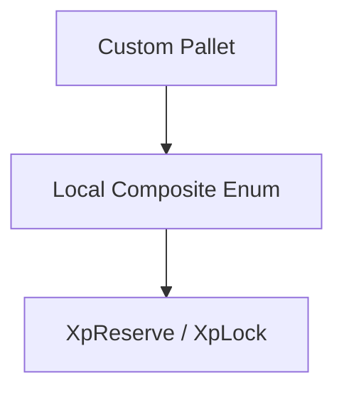
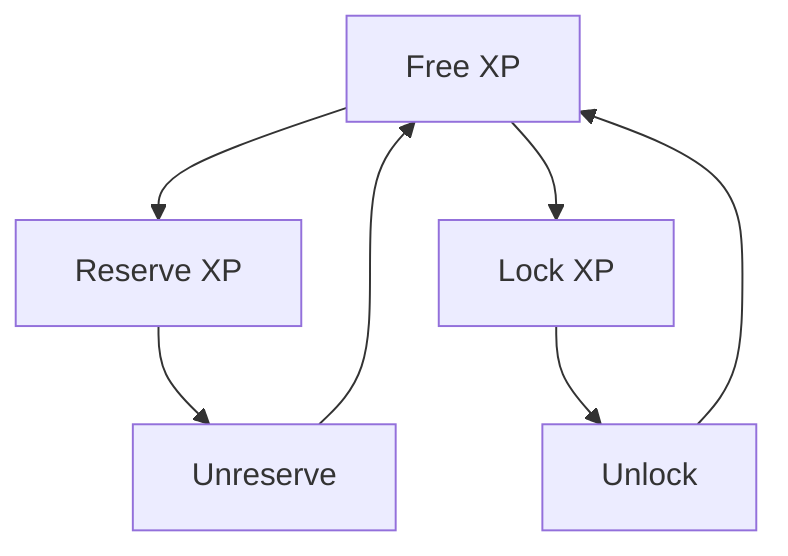

# 🔒 Constraints (Lock & Reserve)

XP can be constrained to control **how it is used inside the runtime**.

Constraints do not transfer XP.

They define how XP may be used, restricted, or committed.

There are two types:

* 📦 **Reserve** -> soft constraint
* 🔒 **Lock** -> hard constraint

These mechanisms allow runtime logic to treat XP as a programmable resource rather than passive stored value.

---

## Why Constraints Exist

Constraints allow XP to be:

* allocated for specific purposes
* restricted from immediate use
* protected from misuse
* controlled by runtime logic
* connected to protocol behavior

This makes XP useful for governance, staking, participation systems, and long-term commitment models.

---

## 📦 1. Reserve (Soft Constraint)

Reserved XP is **allocated**, not strictly restricted.

It represents intent rather than hard restriction.

Reserved XP still contributes to usable XP and can be released later.

### Characteristics

* still part of **usable XP**
* temporarily allocated for a purpose
* can be unreserved later
* does not directly affect Pulse growth

Reserve is useful when XP must be marked for participation without fully removing access.

### Examples

* 🗳️ Governance voting
* 📜 Proposal deposits
* 📊 Temporary allocations
* 🧾 Participation requirements

Reserve expresses usage intent.

---

## 🔒 2. Lock (Hard Constraint)

Locked XP is **strictly restricted**.

It represents commitment rather than temporary allocation.

Locked XP cannot be partially used while active.

### Characteristics

* unavailable for normal usage
* cannot be partially withdrawn
* represents commitment or staking intent
* improves future Pulse progression

Lock is stronger than reserve because it changes both access and growth behavior.

### Examples

* 🏦 Staking
* ⏳ Long-term commitments
* ⚙️ Protocol restrictions
* 🛡️ Security guarantees

Lock expresses commitment.

---

## ⚖️ Reserve vs Lock

| Feature      | 📦 Reserve | 🔒 Lock                     |
| ------------ | ---------- | --------------------------- |
| Restriction  | Soft       | Hard                        |
| Usable XP    | ✅ Yes      | ❌ No                        |
| Purpose      | Allocation | Commitment                  |
| Pulse Impact | ❌ None     | ⚡ Accelerates future growth |
| Withdrawal   | Flexible   | Strict                      |

Both are constraints, but they serve very different protocol purposes.

> **Note**: Reserved XP remains part of the XP identity's usable balance, but is earmarked for a specific purpose.

---

## 🧠 Reason-Based Constraints

Both reserve and lock are tied to a **reason identifier**.

```text
IdXp<Reason, Value>
```

This means every constrained amount of XP is linked to *why* it exists.

The system tracks both:

* the amount
* the purpose

This creates precise runtime control.

### Why Reasons Matter

Reasons provide:

* multiple independent constraints
* no conflicts across pallets
* clear ownership of intent
* safe interoperability

Without reasons, multiple systems would overwrite each other's state.

Reasons make constraints composable.

---

## Substrate Composite Enum Integration

XP integrates naturally with Substrate's native patterns:

* 🧱 `HoldReason`
* 🧊 `FreezeReason`

This allows external pallets to define their own reserve and lock reasons without modifying `pallet-xp`.

### Example

```rust
#[pallet::composite_enum]
enum MyReserveReason {
    Governance,
    Proposal,
}

#[pallet::composite_enum]
enum MyLockReason {
    Staking,
    Commitment,
}
```

Used as:

```rust
IdXp<MyReserveReason, Value>
IdXp<MyLockReason, Value>
```

Each pallet controls its own semantic meaning.

### Architecture



This keeps the system modular and avoids centralized constraint logic.

### Why This Is Powerful

* 🧩 Fully modular
* ⚙️ Native Substrate compatibility
* 🔌 Easy integration across pallets
* 🛡️ Safe constraint isolation

It enables many independent runtime systems to safely share the same XP layer.

---

## 🔌 Trait Adapter Compatibility

XP exposes constraints through native XP traits:

* `XpReserve`
* `XpLock`

and also supports compatibility through:

* 🪙 `fungible::hold`
* ❄️ `fungible::freeze`

This allows existing balance-oriented pallets to work with XP without requiring custom rewrites.

### Result

Other pallets can:

* reuse existing balance logic
* treat XP like a constrained balance abstraction
* avoid writing custom adapters
* integrate with XP using familiar Substrate patterns

This is one of the strongest design advantages of the pallet.

---

## Constraint Lifecycle



Constraints are reversible.

They shape behavior without changing ownership.

---

## Key Properties

### 1. Reason-Based Isolation

Every constraint is scoped by a reason.

This prevents interference between independent runtime modules.

### 2. Composable Design

Multiple pallets can reserve or lock XP independently.

No single pallet owns the entire constraint system.

### 3. Runtime Integration

The model follows native Substrate patterns instead of introducing custom abstractions.

This improves maintainability and compatibility.

### 4. Flexible Usage

The system supports both:

* soft allocation (`reserve`)
* strict commitment (`lock`)

This allows protocol designers to choose the right behavioral model.

---

## Final Insight

> ⚙️ Constraints make XP a programmable resource,
> not just stored value.

Reserve defines intent.

Lock defines commitment.

Together, they turn XP into a runtime-native behavioral primitive.

---

## 🚀 Next Steps

To understand how the full system fits together:

👉 **Architecture -> [Overview](../architecture/overview.md)**
