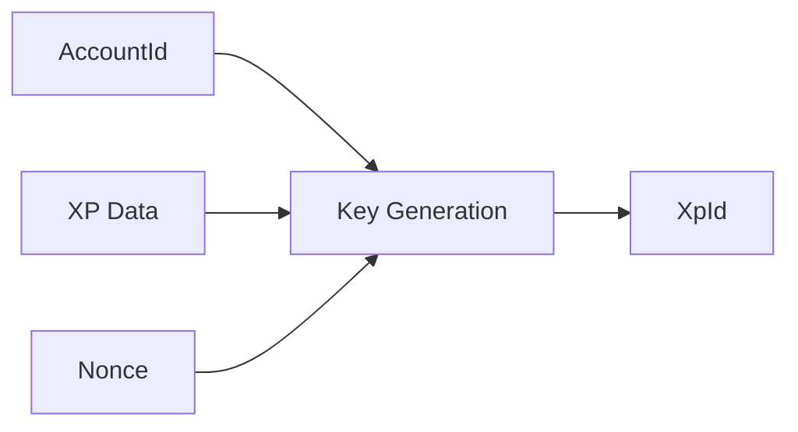
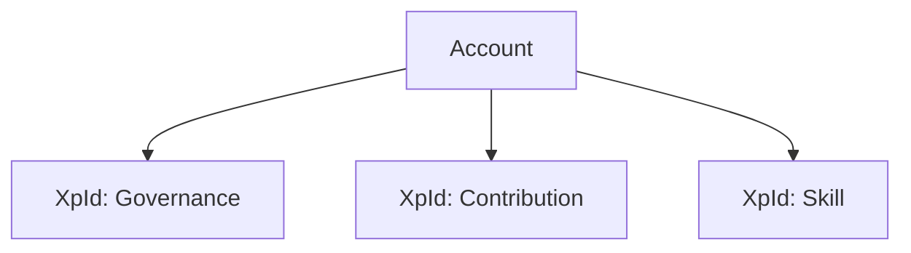
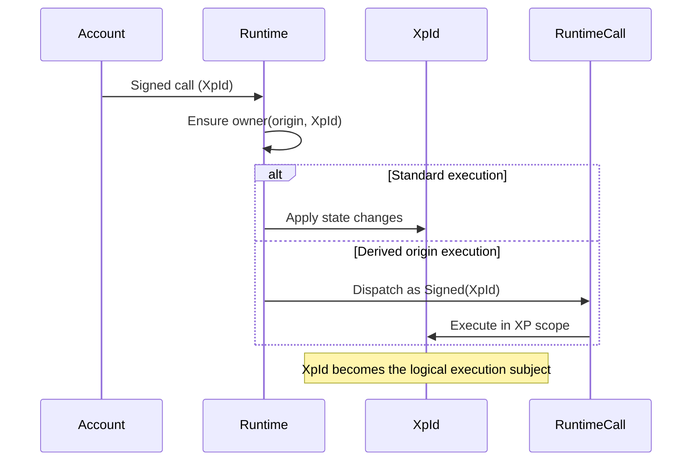

# 🧬 Identity Model

The identity model in `pallet-xp` separates two fundamental layers:

| Layer       | Responsibility                        |
| ----------- | ------------------------------------- |
| `AccountId` | Authorization (who signs)             |
| `XpId`      | State + execution context (what acts) |

> ⚡ This separation is the core foundation of the system.

Instead of storing XP directly inside accounts, the runtime treats XP identities as first-class execution subjects.

---

## Account vs XP

| Concept     | Role                                             |
| ----------- | ------------------------------------------------ |
| `AccountId` | Signs and authorizes transactions                |
| `XpId`      | Holds XP state and acts as the execution subject |

This allows runtime logic to remain identity-scoped rather than account-scoped.

---

## Core Relationship

An account does **not contain XP**.

Instead:

> 👤 Account **owns** -> 🧠 XP identities

A single account may own multiple XP identities, and each identity evolves independently.

This creates clear separation between:

* who may authorize actions
* what the system actually operates on

---

## Why XP is Separate from Accounts

If XP lived directly inside accounts:

* ❌ No context separation
* ❌ No multiple independent identities
* ❌ No behavioral isolation
* ❌ No XP-scoped execution

With separation:

| Benefit                    | Outcome                          |
| -------------------------- | -------------------------------- |
| 🎭 Multiple roles          | One account -> many identities    |
| 🧩 Isolation               | Each XP evolves independently    |
| 🧠 Context-aware logic     | Behavior tied to XP, not account |
| ⚙️ Runtime-native identity | XP becomes an execution layer    |

This model is what makes advanced governance and reputation systems possible.

---

## XP Key (`XpId`)

An `XpId` is:

* a unique identifier
* controlled by an owner
* the primary key for XP state
* the execution context for runtime logic

It is not just a storage reference, it is the unit the protocol acts upon.

### Key Generation

XP keys are deterministically generated using:

* owner account
* XP data
* account nonce (salt)

This ensures:

* uniqueness
* reproducibility
* collision resistance

The pallet performs this through deterministic key derivation rather than external keypairs.

### Key Generation Flow



---

## Multiple Identities per Account

A single account can manage multiple XP identities:



Examples:

* governance reputation
* contributor credibility
* skill progression
* protocol participation

Each identity remains isolated and independently controlled.

---

## Ownership Transfer

XP value itself is **not transferable**, but **ownership is**.

This distinction is critical.

### Transfer Model


The `handover` extrinsic transfers control of the XP identity, not the XP value stored inside it.

### Important Distinction

| ❌ Not Allowed      | ✅ Allowed              |
| ------------------ | ---------------------- |
| Transfer XP value  | Transfer XP ownership  |
| Trade XP           | Migrate identity       |
| Use XP as currency | Preserve XP continuity |

Ownership transfer supports:

* governance delegation
* account migration
* organization transitions
* identity continuity

without converting XP into a tradable asset.

---

## XP as Execution Context

XP is both:

* an **execution target** (passed as input)
* a **derived execution origin** (used for scoped execution)

This is one of the most important concepts in the pallet.

---

## Interaction Model

```text
origin: AccountId   -> authorization
input:  XpId        -> execution context
```

### Mental Model

```text
AccountId = who may authorize
XpId      = what the system acts upon
```

### Execution Flow



This enables runtime logic to execute *through* XP identities rather than only through accounts.

---

## Important Clarification

### `XpId` is NOT a native account

* ❌ `XpId` does not sign transactions
* ❌ `XpId` is not a wallet
* ❌ `XpId` is not a replacement for `AccountId`

Instead:

* ✅ it is passed as input
* ✅ ownership is verified first
* ✅ it can become a derived (logical) origin

This is always enforced through:

```rust
ensure(owner(origin, XpId));
```

Security always begins with account ownership verification.

---

## Key Insight

> ⚙️ Logic operates on XP keys as input, and through them as the execution origin.

This makes XP a runtime-native identity layer, not just a balance container.

That distinction defines the entire architecture of `pallet-xp`.

---

## 🚀 Next Steps

To understand how XP identities maintain reputation and scaled-scoring via a heart-beat mechanism

👉 **Concepts -> [Pulse](./pulse.md)**
