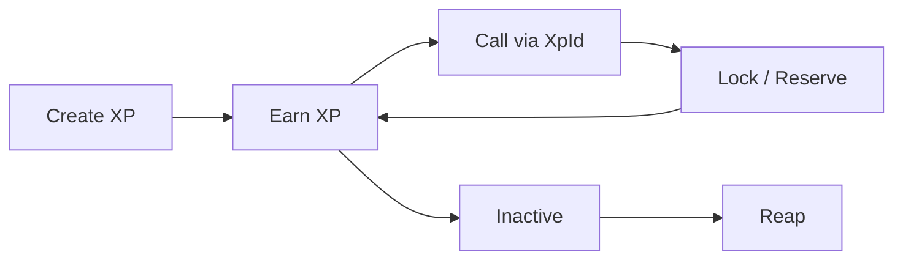
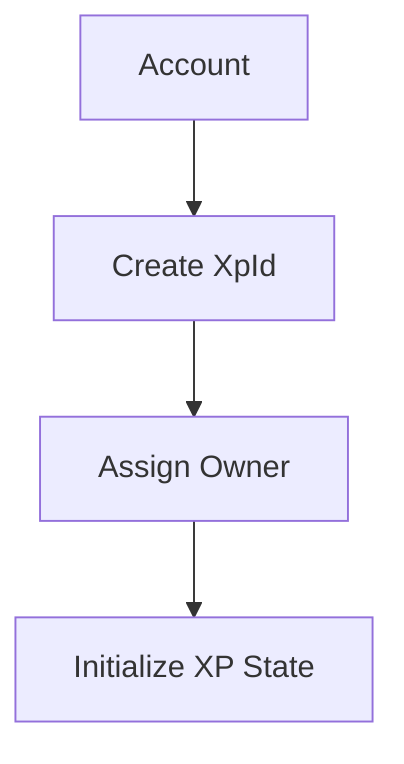
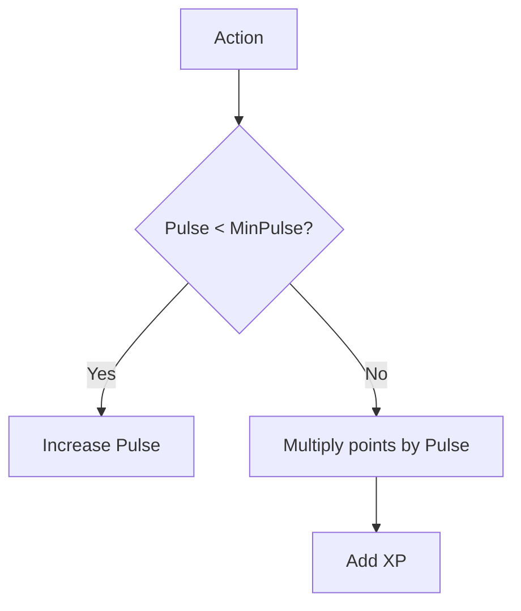
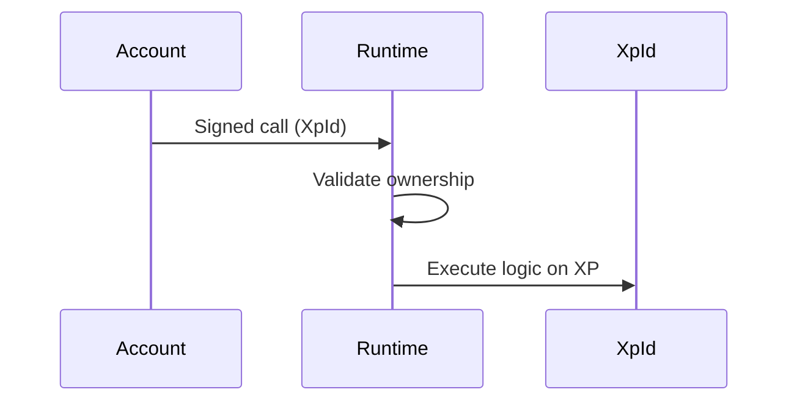
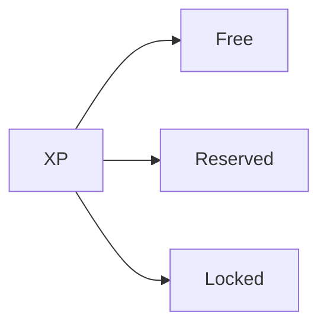
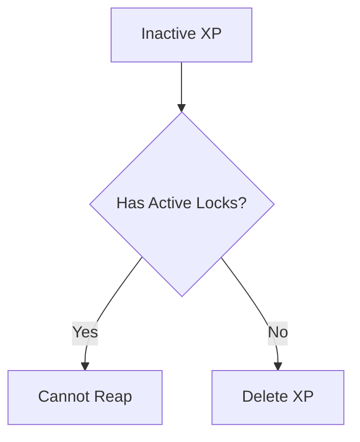
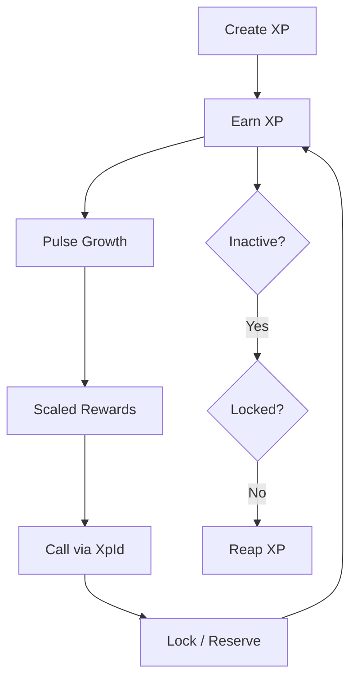

# 🔄 XP Lifecycle

The XP lifecycle defines how an XP identity evolves over time.

It answers:

* how XP is created
* how it grows
* how it is constrained
* how it becomes inactive
* how it is permanently removed

Unlike tokens, XP is not meant for passive holding.

It exists only while it remains meaningful to the system.

---

## High-Level Lifecycle



This is the complete lifecycle of an XP identity.

---

## 🆕 1. Creation

An XP identity begins when a new `XpId` is initialized.

Creation includes:

* generating a new XP key
* assigning ownership
* initializing state
* setting the starting XP value (`InitXp`)

This creates a valid runtime identity that can participate in the protocol.

### Creation Flow



### Initial State

```text
Free XP   = InitXp
Pulse     = 0
Timestamp = current block
```

At creation, XP starts with no reputation and must earn trust over time.

---

## 📈 2. Earning (Reputation-Driven Growth)

XP does not grow through direct increments.

It grows through the **Pulse system**, where reputation controls both access to rewards and reward size.

### 🌱 Early Stage

When:

```text
Pulse < MinPulse
```

then:

* XP is not awarded
* Pulse increases instead

This is the warmup phase.

### 🚀 Active Stage

When:

```text
Pulse >= MinPulse
```

then:

* XP earning becomes active
* rewards scale using Pulse

Higher reputation produces stronger rewards.

### Earning Flow



### Key Properties

| Property            | Meaning                         |
| ------------------- | ------------------------------- |
| ⏳ Time-dependent    | XP cannot be rushed             |
| 📈 Reputation-based | Pulse controls growth           |
| 🛡️ Anti-spam       | Same-block farming is prevented |

XP rewards consistency, not bursts.

---

## ⚙️ 3. Execution (Call via XpId)

XP is not passive storage.

It is used as an execution context inside runtime logic.

### Execution Model

```text
origin: AccountId
input:  XpId
ensure: owner(origin, XpId)
```

### Mental Model

```text
AccountId = who authorizes
XpId      = what the system acts upon
```

The account signs.

The XP identity becomes the execution subject.

### Execution Flow



### Effect

* 🧠 Logic is scoped to XP identities
* 🎭 Enables multi-role participation
* ⚙️ XP becomes a runtime-native execution subject

This is what separates XP from simple balances.

---

## 🔒 4. Constraints (Lock & Reserve)

XP can be constrained in two different ways.

These constraints affect usability, liveness, and future growth.

### Lock (Hard Constraint)

A lock is a strict restriction.

* 🚫 XP becomes unavailable for partial use
* ❌ Cannot be partially withdrawn
* 🧠 Represents commitment or staking intent

Locked XP also improves future Pulse growth.

### Reserve (Soft Constraint)

A reserve is a soft allocation.

* 📌 XP is marked for a specific purpose
* ✅ Still usable within that context
* 🔄 Can be released later

Reserved XP represents intent, not hard restriction.

### Constraint Flow



### Effect

* 🎛️ Controls how XP can be used
* 📈 Locking improves long-term rewards
* 🛡️ Prevents misuse of committed XP

Constraints are behavioral tools, not balance transfers.

---

## ⏳ 5. Inactivity

XP liveness is determined by **activity**, not minimum balance.

Every XP identity tracks its last meaningful interaction using a timestamp.

### Inactivity Rule

```text
if timestamp < MinTimeStamp
AND no active locks
-> XP becomes inactive
```

### Meaning

* XP is no longer considered alive
* it becomes eligible for reaping

This prevents abandoned XP from remaining permanently valid.

---

## 🧹 6. Reaping (Permanent Deletion)

Inactive XP can be permanently removed from the system.

This process is called **reaping**.

Reaping is not a balance reduction.

It is full identity invalidation.

### Reaping Flow



### Result

* ❌ XP entry is removed
* 🚫 Identity cannot be reused
* 🗑️ Historical state is permanently lost

Reaping ensures XP reflects active participation, not passive storage.

---

## Full Lifecycle Flow



This is the full operational lifecycle of the XP system.

---

## Lifecycle Properties

| Property         | Meaning                            |
| ---------------- | ---------------------------------- |
| Progressive      | Grows through participation        |
| Activity-driven  | Inactive XP can be removed         |
| Constraint-aware | Locks and reserves affect behavior |
| Identity-centric | Everything is tied to `XpId`       |

XP is alive only while it is being used.

---

## ⚡ What Makes This Unique

Compared to traditional tokens:

| 🪙 Tokens                  | ⚡ XP             |
| -------------------------- | ---------------- |
| Passive holding            | ❌ Not sufficient |
| Permanent balance          | ❌ Not guaranteed |
| Value storage              | ❌ Not the goal   |
| Activity-based progression | ✅ Core principle |

XP is a living identity, not a stored asset.

---

## Key Insight

> XP exists only as long as it is
> actively used, maintained, or committed.

This is what makes the lifecycle fundamentally different from token systems.

---

## 🚀 Next Steps

To understand how constraints work in detail:

👉 **Concepts -> [Constraints (Lock & Reserve)](./constraints.md)**
