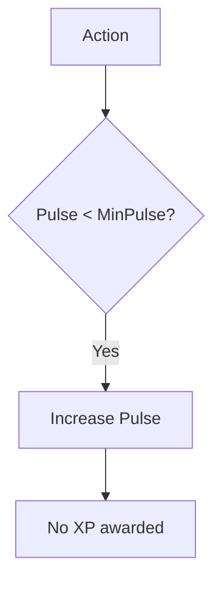
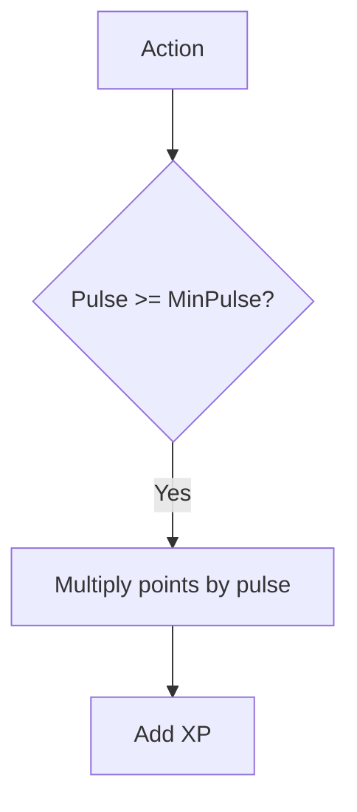
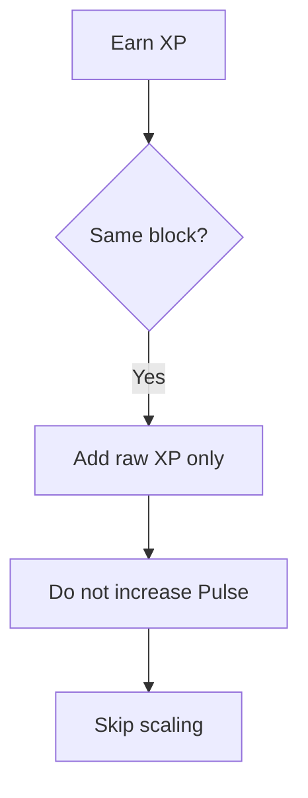
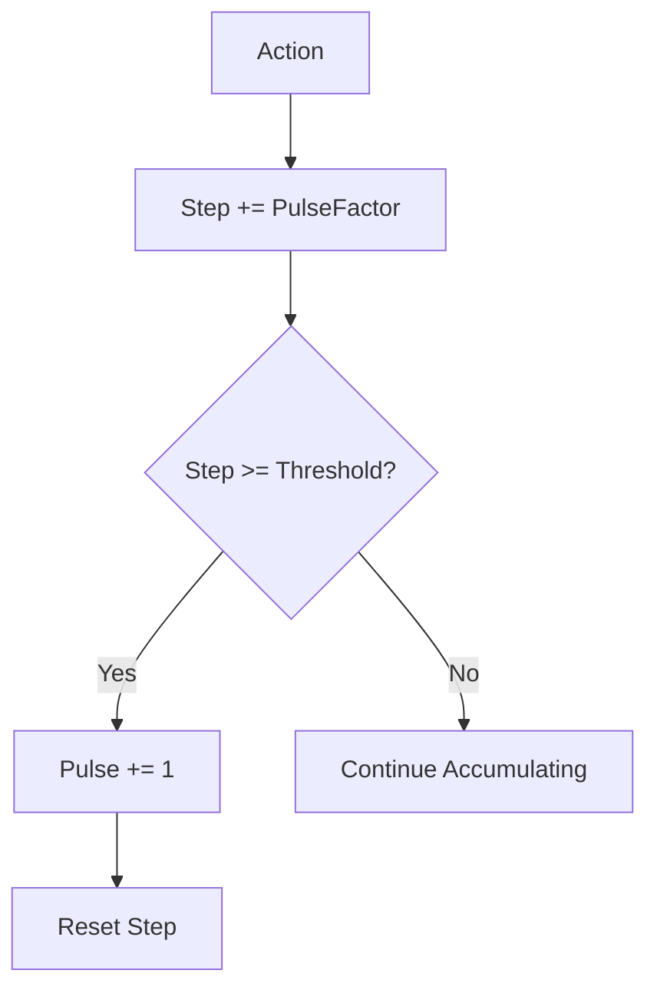
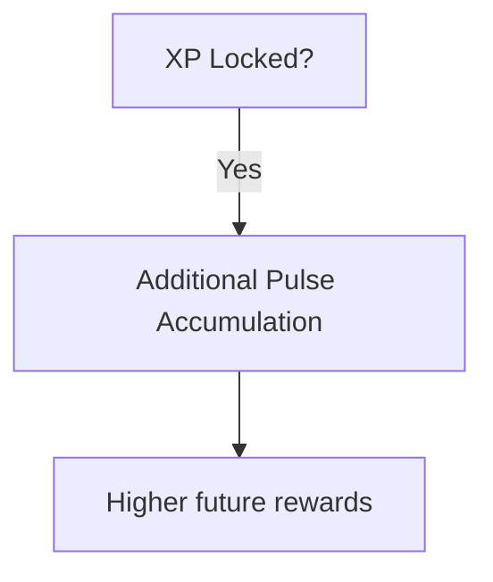
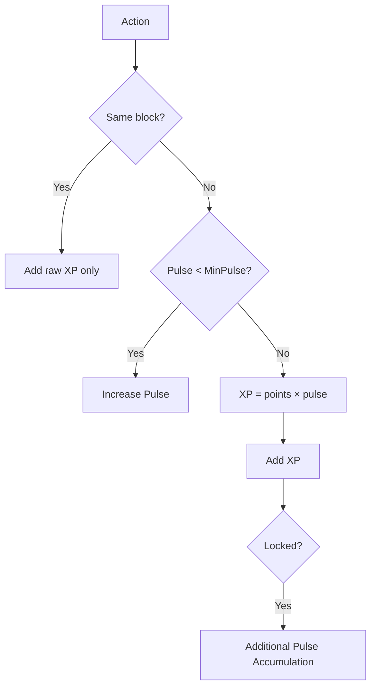
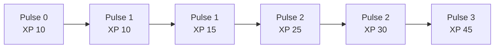

# 💓 Pulse (Reputation System)

Pulse is the **protocol's reputation engine** in `pallet-xp`.

> It decides **when XP is earned** and **how much XP is granted**

XP is not rewarded immediately through simple increments.

Instead, users must first build **reputation over time**.

This ensures XP reflects consistency, not short-term activity.

---

## What is Pulse?

Pulse is a **discrete reputation score** attached to each XP identity.

It represents:

* consistency of activity
* frequency of participation
* long-term engagement
* behavioral trust within the system

Pulse is not XP itself.

It determines how XP grows.

### Why Pulse Exists

Without Pulse:

* ⚠️ XP could be farmed instantly
* ⚠️ One-time actions would dominate rewards
* ⚠️ New users and trusted contributors would be treated the same
* ⚠️ Same-block abuse would be easy

With Pulse:

> XP rewards **consistent behavior**, not bursts.

This creates a reputation-driven progression system instead of a simple balance counter.

### Core Idea

XP earning happens in two phases:

```text
Warmup -> Active
```

Before users can earn meaningful XP, they must first establish reputation.

### `MinPulse`

`MinPulse` is the minimum reputation threshold required before XP rewards begin.

Below this threshold:

* XP is not awarded
* actions only build Pulse

Once this threshold is reached:

* XP earning becomes active
* rewards begin scaling with Pulse

This prevents instant farming by new identities.

---

## 🌱 Phase 1: Warmup (Reputation Building)

When:

```text
Pulse < MinPulse
```

then:

* ❌ No XP is awarded
* ✅ Pulse increases

### Warmup Flow



During this phase, the system is measuring consistency rather than rewarding output.

---

## 🚀 Phase 2: Active (XP Scaling)

When:

```text
Pulse >= MinPulse
```

then:

* ✅ XP starts being awarded
* 📈 rewards scale using Pulse

### Scaling Formula

`XP += points * pulse`

Higher reputation produces stronger rewards.

### Active Flow



XP growth becomes reputation-weighted rather than linear.

---

## Same-Block Protection

Same-block protection prevents abuse within a single block.

### Rule

```text
current_block <= last_updated_block
AND pulse >= MinPulse
```

Then:

* ➕ XP is added as **raw points only**
* ❌ Pulse does NOT increase
* ❌ No multiplicative scaling is applied

### Flow



### Effect

* 🚫 Prevents pulse farming within a block
* 🚫 Prevents artificial reward bursts
* ⏳ Ensures progression remains time-based

### Key Insight

> Same-block actions bypass reputation scaling
> and only grant base (raw) XP.

---

## Why Pulse Uses Block Time

Pulse progression depends on **block progression**, not transaction count.

This ensures reputation reflects sustained participation over time rather than rapid repeated actions inside a single block.

It is one of the main reasons XP cannot be rushed.

---

## `PulseFactor`

`PulseFactor` controls how quickly repeated actions convert into Pulse growth.

It defines how much internal progress is added for each eligible action.

Together with the accumulator threshold, it determines the speed of reputation growth.

---

## Pulse Growth Mechanism

Pulse grows using a **discrete accumulator**, not direct per-action increments.

Each XP identity maintains an internal **step counter**.

### How It Works

Every eligible action:

* increments the step counter
* uses `PulseFactor` as the increment size

When the accumulated step reaches a threshold:

* Pulse increases by `1`
* the step counter resets
* accumulation continues

### Concept

step += PulseFactor

```text
if step >= threshold:
    pulse += 1
    step = 0
```

### Flow



### Why This Design Exists

* ⏳ Time-weighted progression
  Pulse grows gradually, not instantly

* 🚫 Prevents burst farming
  Multiple actions are required before reputation increases

* ⚙️ Configurable growth rate
  `PulseFactor` and threshold define system difficulty

### Key Insight

> Pulse is not incremented per action ,
> it is earned through accumulated activity over time.

---

## 🔒 Lock-Based Acceleration

If XP is locked:

* additional Pulse accumulation can occur after XP earning

This accelerates future reputation growth.

### More Precisely

Locking does not directly grant extra XP.

Instead, it allows faster future Pulse progression, which increases future rewards.

> Currently, it looks for **lock exists**, in the **future we will integrate lock value based scaling**

### Flow



### Effect

* 🧠 Rewards commitment
* 📈 Improves long-term progression
* 🔒 Incentivizes stronger participation

---

## Full Earning Flow



This is the full reputation-driven lifecycle of XP earning.

---

## Example: XP + Pulse in Action

### Initial State

```text
Free XP   = 10
Pulse     = 0
MinPulse  = 1
Points    = 5
Block     = 10
```

### Step 1: Warmup

```text
Pulse < MinPulse -> build reputation
```

Result:

* Pulse increases from `0 -> 1`
* XP remains unchanged

```text
Free XP = 10
Pulse   = 1
```

### Step 2: Active Phase

```text
Current Pulse = 1
XP += 5 × 1 = 5
```

```text
Free XP = 15
Pulse   = 1
```

### Step 3: Higher Reputation

```text
Current Pulse = 2
XP += 5 × 2 = 10
```

```text
Free XP = 25
Pulse   = 2
```

### Step 4: Same Block

```text
Current Pulse = 2
XP += 5
```

Only raw XP is added.

```text
Free XP = 30
Pulse   = 2  ← unchanged
```

### Step 5: High Reputation

```text
Current Pulse = 3
XP += 5 × 3 = 15
```

```text
Free XP = 45
Pulse   = 3
```

### Visual Progression



---

## Key Properties

| Property            | Meaning                               |
| ------------------- | ------------------------------------- |
| Time-based          | XP cannot be rushed inside one block  |
| Reputation-weighted | Higher Pulse -> stronger rewards       |
| Anti-spam           | Same-block pulse farming is prevented |
| Commitment-driven   | Locked XP improves future growth      |

### What Pulse is NOT

* ❌ Not a balance
* ❌ Not transferable
* ❌ Not directly controlled
* ❌ Not manually assigned

> Pulse is earned behavior, not assigned value.

---

## Final Insight

> ⚡ XP = what you did, 
> 💓 Pulse = how consistently you did it

XP reflects output.

Pulse reflects trust.

Together, they create progression that is difficult to fake.

---

## 🚀 Next Steps

To understand how XP evolves from creation to reaping:

👉 **Concepts -> [Lifecycle](./lifecycle.md)**
