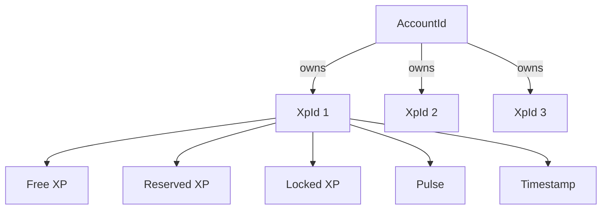
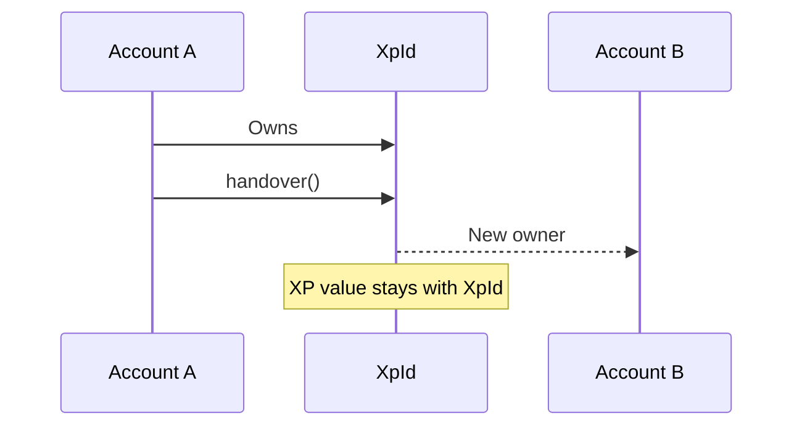
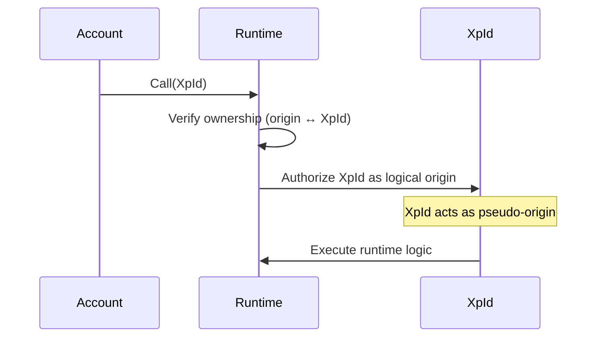
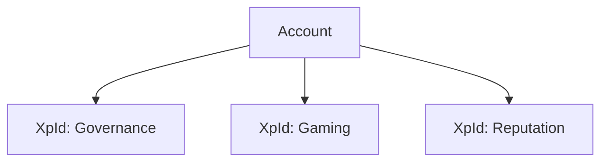

---

toc_min_heading_level: 2
toc_max_heading_level: 2
---

# 🧠 XP Model

XP (Experience Points) is the **core primitive** of `pallet-xp`.

> ✨ It represents **reputation, contribution, and progression**, not money.

Unlike tokens, XP is designed for **trust, participation, and system-native identity**, not financial exchange.

---

## What is XP?

XP is a **structured, identity-bound state**, not just a number.

Each XP entry:

* is identified by an **XP key (`XpId`)**
* is owned by an **account**
* stores multiple dimensions of state
* evolves through consistent participation

XP earning is governed by an internal reputation system called **Pulse**, which rewards long-term activity and prevents burst farming.

---

## ⚖️ XP vs Tokens

| Property                 | 🪙 Tokens   | ⚡ XP       |
| ------------------------ | ----------- | ---------- |
| Transferable Value       | ✅ Yes       | ❌ No       |
| Global Supply            | ✅ Yes       | ❌ No       |
| Monetary Value           | ✅ Yes       | ❌ No       |
| Context-specific Meaning | ❌ No        | ✅ Yes      |
| Earned Through Actions   | ⚠️ Optional | ✅ Required |
| Reputation-based Growth  | ❌ No        | ✅ Yes      |

> XP values are numerically comparable, but their meaning is context-dependent and not economically interchangeable.

---

## XP is Identity-Based

XP is **not tied to account balances**.

Instead:

* Accounts **own XP keys**
* XP keys **hold state**
* Runtime logic operates **on and through XP keys**

This makes XP a runtime-native identity system rather than a transferable asset.

---

## Identity Model



---

## XP Structure

Each XP entry contains:

| Component      | Meaning                  |
| -------------- | ------------------------ |
| 🟢 Free XP     | Usable XP points         |
| 📦 Reserved XP | Temporarily allocated XP |
| 🔒 Locked XP   | Restricted XP usage      |
| 💓 Pulse       | Reputation score         |
| ⏱️ Timestamp   | Last activity / liveness |

These together define both **value state** and **behavioral reputation**.

---

## XP is Contextual

XP is not globally meaningful like tokens.

Its meaning depends on the runtime system using it.

Different XP keys may represent:

* 🗳️ Governance reputation
* 🧑‍💻 Contributor score
* 🎮 Skill progression
* 📊 Participation history
* 🧠 Domain-specific trust

The same numeric XP value can mean completely different things in different contexts.

---

## XP is Not Transferable

XP **cannot be moved as value**.

You cannot:

* ❌ Send XP to another account
* ❌ Trade XP
* ❌ Use XP as currency
* ❌ Create market value from XP

> XP is earned, not traded.

---

## What Can Change?

Only these lifecycle actions are allowed:

* XP can be **earned**
* XP can be **locked or reserved**
* XP can be **reaped if inactive**
* XP ownership can be **transferred**

XP value itself is never transferred between users.

---

## Ownership vs Value Transfer

Ownership transfer is performed using the `handover` extrinsic.

This transfers control of the XP identity, not the XP value itself.



### Why Ownership Transfer Exists

Ownership transfer supports:

* governance delegation
* account migration
* organization transitions
* identity continuity

This preserves XP history without turning XP into a tradable asset.

---

## XP Key as Execution Context

XP is not just stored state, it is the **runtime subject of execution**.

Most logic operates on:

```rust
origin: AccountId   // authorization
input:  XpId        // execution target
```

### Mental Model

```text
AccountId = who may authorize
XpId      = what the system acts upon
```

* `XpId` is passed as input
* ownership is verified first
* after validation, `XpId` becomes the logical (pseudo) origin of execution

```rust
ensure(owner(origin, XpId))
```

> 👤 Accounts authorize actions
> 🧠 XP identities are the unit of execution

---

## Execution Flow



---

## Multiple XP per Account

A single account can control multiple XP identities:



This allows one user to participate across multiple independent domains.

---

## Why This Model Exists

### 1. Separation of Concerns

* Account -> authorization
* XP -> state + execution context

### 2. Context Isolation

Each XP key can behave independently.

### 3. Safer Systems

Actions are scoped to XP identities, not entire accounts.

### 4. Programmability

XP becomes a **runtime-native identity layer**, enabling advanced governance, contribution systems, and reputation-driven protocols.

---

## 🚀 Next Steps

To understand how XP identities (keys) work in detail:

👉 **Concepts -> [Identity Model](./identity.md)**
