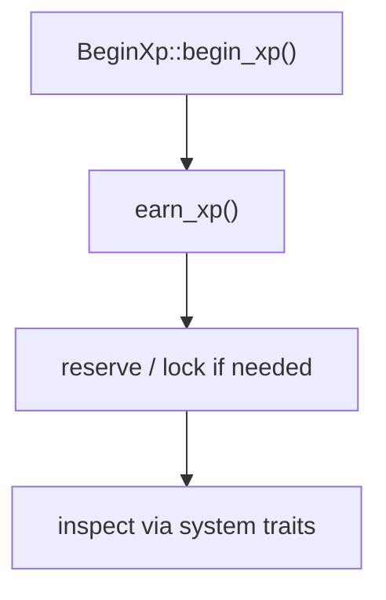

# 🌱 First XP Identity

After configuring `pallet-xp`, the next step is creating your first XP identity.

Most of this internals are exposed and documented in crate `frame_suite::xp`

An XP identity is created around:

```text
Owner (AccountId) -> owns -> XpId -> holds XP state
```

This is the beginning of the full XP lifecycle.

### Three Ways to Create XP

There are three primary ways to initialize an XP identity:

| Method                  | Behavior                                  | Recommended Use                      |
| ----------------------- | ----------------------------------------- | ------------------------------------ |
| `BeginXp::begin_xp()`   | Manual initial points + reaped protection | ✅ Preferred for user-facing creation |
| `XpMutate::create_xp()` | Uses configured `InitXp` value            | ✅ Controlled/runtime integrations    |
| `XpMutate::new_xp()`    | Creates identity only                     | ⚠️ Low-level/internal use            |

The differences are important because each method provides a different level of lifecycle management and initialization behavior.

---

## 0. Key Generation (`XpOwner::xp_key_gen`)

Before creating an XP identity, a unique `XpId` must be provided.

A convenient helper from `XpOwner` trait is:

```rust
XpOwner::xp_key_gen(owner, xp)
```

This generates a deterministic XP key using:

* the owner account
* XP data (`Default` works)
* the owner's current account nonce

This provides a simple nonce-based key derivation mechanism and is the recommended way to generate XP keys.

Although, since `XpId` uses the runtime's `AccountId` type, applications may use their own key generation strategy.

Xp identity generation methods only requires that the supplied key is:

* unique
* deterministic
* valid for the runtime's `AccountId`

This keeps the focus on the important takeaway:

> XpId generation is separate from XP creation.

## 1. Safe Creation (`BeginXp`)

### Recommended Method

```rust
BeginXp::begin_xp(owner, key, points)
```

This is the safest and preferred way to create a new XP identity.

The caller supplies both:

* the XP key
* the initial XP points

`begin_xp()` performs:

* ownership initialization
* manual XP point initialization
* lifecycle-safe creation
* reaped XP protection

Most importantly, it checks whether the XP key has previously been reaped.

If an XP identity was deleted through reaping, it cannot be initialized again through this API.

This provides lifecycle finality and makes `BeginXp` the recommended production-safe creation path.

Use `begin_xp()` when:

* custom initial XP points are required
* reaped XP must never be recreated
* lifecycle safety is important

---

## 2. Controlled Creation (`XpMutate::create_xp`)

### Uses Configured `InitXp`

```rust
XpMutate::create_xp(owner, key)
```

This method creates an XP identity and initializes it using the configured `InitXp` value.

Unlike `begin_xp()`:

* initial XP points are not supplied manually
* no reaped-state validation is performed

Therefore, if reaped XP protection is required, the caller must explicitly verify it:

```rust
XpReap::is_reaped(key)
```

before creation.

This method is useful when:

* the runtime already defines a standard `InitXp`
* initialization should follow pallet configuration
* lifecycle checks are handled externally

---

## 3. Low-Level Creation (`XpMutate::new_xp`)

### Identity Initialization Only

```rust
XpMutate::new_xp(owner, key)
```

This is the lowest-level creation primitive.

It only creates the XP identity and ownership records.

No XP points are initialized.

After creation, XP must be assigned separately using APIs such as:

```rust
XpMutate::set_xp(key, points)
```

or

```rust
XpMutate::earn_xp(key, points)
```

This method is primarily intended for:

* internal runtime logic
* advanced custom flows
* migrations
* specialized initialization sequences

### Use `XpMutate::create_xp()`

When:

* XP should start with the configured `InitXp`
* lifecycle checks are managed by the caller
* integrating with controlled runtime logic

### Use `XpMutate::new_xp()`

When:

* only the XP identity should be created initially
* XP will be assigned later via `set_xp()` or `earn_xp()`
* low-level control is required

---

## XP Earning Models

Once XP exists, the preferred method for earning xp-points is via the `XpMutate` trait:

```rust
XpMutate::earn_xp(key, points)
```

not:

```rust
XpMutate::set_xp(key, points)
```

---

## 1. Earn with Reputation Growth

```rust
earn_xp()
```

is the correct method for normal XP progression.

Why?

Because it applies:

* pulse progression
* reward scaling
* reputation thresholds
* anti-abuse rules
* lifecycle hooks

This preserves the meaning of XP as earned reputation.

This should be your default path 📈

---

## 2. Direct Points Update

```rust
set_xp()
```

directly modifies XP.

It bypasses:

* reputation logic
* earning rules
* trust thresholds

This should only be used for:

* migrations
* admin correction
* genesis operations
* internal runtime resets

Never expose this to users.

The trait itself warns:

> Use with caution

Think of it as:

```text
earn_xp() = reputation-safe

set_xp() = low-level override
```

---

## Inspecting XP State

After creation, you can inspect XP using read traits like:

* `XpSystem`: read XP values like total XP, usable XP, and current state
* `XpOwner`: inspect ownership mappings between `AccountId` and `XpId`
* `XpReserve`: inspect reserved XP and how much is currently held
* `XpLock`: inspect locked or frozen XP that cannot be used

Examples:

| Trait       | Example            | Description                              |
| ----------- | ------------------ | ---------------------------------------- |
| `XpSystem`  | `get_xp()`         | Read the current XP value of an identity |
| `XpOwner`   | `xp_of_owner()`    | Find which `XpId` belongs to an owner    |
| `XpReserve` | `total_reserved()` | Check how much XP is currently reserved  |
| `XpLock`    | `total_locked()`   | Check how much XP is currently locked    |

---

## Recommended Real Flow

The best practical flow is:



because XP should behave like reputation,

not manual balances.

---


## XP Usage Surfaces

There are three common ways to use XP from your runtime or from another pallet.

The best choice depends on how tightly you want your code to depend on `pallet-xp`.

Some projects prefer direct access for simplicity, while others use trait adapters for cleaner architecture.

## 1. Direct Import (Tightly Coupled)

The simplest approach is to directly depend on `pallet-xp` and use:

```rust
use pallet_xp::Pallet;
```

Since `pallet_xp::Pallet<T>` implements all XP traits, you can call methods directly:

```rust
pallet_xp::Pallet<T>::earn_xp(...)
pallet_xp::Pallet<T>::get_xp(...)
pallet_xp::Pallet<T>::begin_xp(...)
```

where `T` implements `frame_system::Config`, which is typically included as a supertrait bound in your pallet's `Config` trait.

This is straightforward and explicit, but it tightly couples your pallet to `pallet-xp`.

Best for:

* internal pallets
* protocol-owned modules
* fast development
* simple integrations

---

## 2. Config Trait Adapter (Recommended)

A cleaner production pattern is to expose XP through your pallet's `Config` trait.

Example:

```rust
#[pallet::config]
pub trait Config: frame_system::Config {
    // Choose only the XP traits your pallet actually needs
    // and add them here as trait bounds.
    //
    // Examples:
    // XpSystem  -> read XP state
    // XpMutate  -> modify XP values
    // BeginXp   -> safely create new XP identities
    //
    // Add only what your logic requires.
    type Xp: XpSystem + XpMutate + BeginXp;
}
```

Then inside your pallet, use:

```rust
T::Xp::earn_xp(...)
```

instead of calling `pallet_xp::Pallet<T>` directly.

At the runtime level, connect it like this:

```rust
impl pallet_example::Config for Runtime {
    type Xp = pallet_xp::Pallet<Runtime>;
}
```

This keeps your pallet loosely coupled and best for

* reusable pallets
* framework-style pallets
* production systems
* long-term maintainability

This is usually the best design choice.

---

## 3. Direct Runtime Usage (Quick Prototyping)

If you are writing logic directly inside the runtime and want fast iteration, you can simply use:

```rust
pallet_xp::Pallet<Runtime>::earn_xp(...)
```
where `Runtime` is the type which implements all pallets `Config` traits.

Because `pallet_xp::Pallet<Runtime>` already implements all XP traits, no adapter is needed.

Best for:

* runtime experiments
* prototypes
* testing ideas quickly

This is fast and convenient, but less modular.

---

## Quick Reference

| Need                         | Best Method           | Why                                               |
| ---------------------------- | --------------------- | ------------------------------------------------- |
| first XP creation            | `BeginXp::begin_xp()` | safest lifecycle creation + reaped key protection |
| controlled internal creation | `create_xp()`         | creates XP with `init_xp` + hooks                 |
| raw primitive setup          | `new_xp()`            | lowest-level manual XP creation                   |
| normal XP progression        | `earn_xp()`           | applies pulse, reputation, and anti-abuse rules   |
| admin/system override        | `set_xp()`            | direct XP mutation without reputation logic       |
| fastest pallet integration   | direct import         | simplest and fastest setup                        |
| reusable pallet design       | config trait adapter  | clean architecture and loose coupling             |
| runtime-only prototype       | direct runtime usage  | fast experimentation inside runtime               |

For production systems:

> prefer `BeginXp::begin_xp()` + `earn_xp()`
> and use the config trait adapter pattern for pallet integrations

This keeps XP secure, meaningful, and lifecycle-safe.

---

## 🚀 Next Steps

Now that your first XP identity exists, the next step is learning how users interact with XP through pallet extrinsics.

👉 **Core -> [Extrinsics](../core/extrinsics.md)**
